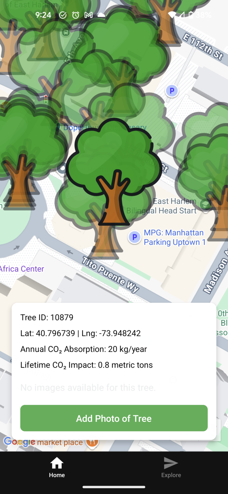

# 🌳 Greener Together

## 📱 About the App

**Greener Together** is a citizen science platform for urban forestry that combines mapping technology with community-driven data collection to promote environmental awareness and tree conservation efforts.

## Core Features
- 🗺️ **Interactive Tree Map** - Explore 46,000+ trees with detailed environmental data
- 📸 **Streeview Photo Upload** - Contribute photos of trees to build a visual database
- 🌍 **Environmental Impact Display** - View CO2 absorption and environmental metrics for each tree
- 📊 **Near-real-time Data** - Live updates and community contributions
- 📱 **Only on Mobile!** - Works on iOS, Android



## 🏗️ Architecture

```
ai-tinkerer-greener-together/
├── frontend/           # Expo frontend
├── backend/            # FastAPI server
├── model/              # AI model development files
├── app.webp
├── package-lock.json
└── README.md           # This file
```

### Frontend - Mobile App (`/greener`)
- **Technology**: React Native with Expo
- **Platform Support**: iOS, Android
- **Key Libraries**: Google Maps, Image Picker, Location Services

### Backend - API Server (`/backend`)
- **Technology**: Python FastAPI, torchvision, resnet18
- **Cloud Services**: Google Cloud Storage, AWS RD2, EC2
- **Database**: Postgresql, pgAdmin, sqlalchemy
- **Data**: Tree census data with CO2 metrics

## 🚀 Quick Start

### Prerequisites
- Node.js (v18 or higher)
- Python 3.8+
- Expo CLI
- Google Cloud Platform account (for image storage)

### 1. Clone the Repository
```bash
git clone <repository-url>
cd ai-tinkerer-greener-together
```

### 2. Setup Frontend (Mobile App)
```bash
cd greener
npm install
npx expo start
```

### 3. Setup Backend (API Server)
```bash
cd backend
pip install -r requirements.txt

# Configure environment variables
cp .env.example .env
# Edit .env with your Google Cloud credentials

# Start the server
uvicorn main:app --reload --host 0.0.0.0 --port 8000
```

### 4. Environment Configuration
Create a `.env` file in the backend directory:
```env
GCS_BUCKET_NAME="your-bucket-name"
GOOGLE_APPLICATION_CREDENTIALS="path/to/service-account-key.json"
```

## 📱 Using the App

### Home Screen - Interactive Map
1. **Explore Trees**: Browse the map to see tree locations
2. **Select a Tree**: Tap on tree markers to view details
3. **View Information**: See CO2 data, species, health status
4. **Photo Gallery**: Browse existing photos of each tree
5. **Add Photos**: Use "Add Photo of Tree" button to contribute

### Tree Information Displayed
- Unique tree ID and GPS coordinates
- Annual CO2 absorption (kg/year)
- Lifetime CO2 impact (metric tons)
- Tree species and health status
- Physical measurements (height, volume, area)

## 🛠️ Development

### Frontend Development
```bash
cd greener
npm run start          # Start Expo development server
npm run android        # Run on Android
npm run ios           # Run on iOS
npm run web           # Run on web
```

### Backend Development
```bash
cd backend
uvicorn main:app --reload --host 0.0.0.0 --port 8000
```

### Data Processing Scripts
```bash
cd greener
npm run filter-trees              # Process tree census data
npm run convert-enhanced-trees    # Convert to app format
```

## 📊 Data

The application includes:
- **46,000+ tree records** from Manhattan/Harlem area
- **Environmental metrics** (CO2 absorption, carbon storage)
- **Physical characteristics** (height, volume, area)
- **Geographic data** (precise GPS coordinates)
- **Community photos** (user-contributed images)

## 🌍 Environmental Impact

Each tree displays:
- **Annual CO2 Absorption**: Amount of CO2 absorbed per year
- **Lifetime CO2 Impact**: Total environmental impact
- **Carbon Storage**: Amount of carbon stored in the tree
- **Health Status**: Current condition of the tree

## 📡 API Endpoints

### Tree Images
- `GET /tree-images/{tree_id}` - Fetch photos for a specific tree
- `POST /upload-image` - Upload new tree photos

### Upload Management  
- `POST /upload-url` - Generate signed URLs for direct uploads

## 🔧 Configuration

### Google Cloud Setup
1. Create a Google Cloud Project
2. Enable Cloud Storage API
3. Create a service account and download credentials
4. Create a storage bucket for images
5. Configure environment variables

### Mobile App Configuration
Update `greener/services/uploadService.ts` with your API URL:
```typescript
const PROD_API_URL = 'https://your-api-domain.com';
```

## 🤝 Contributing

1. Fork the repository
2. Create a feature branch
3. Make your changes
4. Test thoroughly
5. Submit a pull request

### Areas for Contribution
- Additional environmental data integration
- Enhanced photo management features
- Tree health tracking over time
- Community engagement features
- Data visualization improvements

## 📄 License

This project is part of the AI Tinkerer community initiative for environmental awareness and urban forestry.

## 🆘 Support

For questions, issues, or contributions:
- Check the existing issues
- Create detailed bug reports
- Share feature suggestions
- Contribute to documentation

---

**Made with 🌱 for a greener future** 
